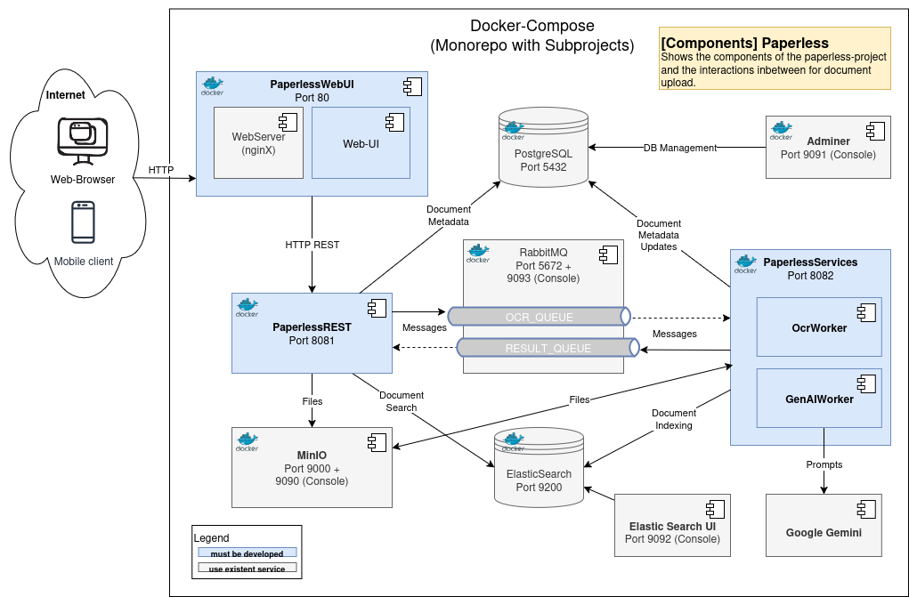

# BIF4-WS2025-SWEN3


[](https://dotnet.microsoft.com/)
[](https://docs.docker.com/compose/)

**Semester Project:** Document Management System  
**Name:** Paperless_Dahlke_Raso

Dieses Repository enthält eine Dokumentenmanagement-Anwendung (`Blazor` UI + `REST`-API + Hintergrund-Worker). Die gesamte Lösung wird als Multi-Container-Setup mittels Docker Compose betrieben.


---

## Schnellübersicht
- Start:    `docker compose up --build` (Projekt-Root)  
- Haupt-UI: `https://localhost` (Host-Port `443`)  
- REST API: `https://localhost:8081`

> [!TIP]
> Für eine detaillierte Anleitung zum starten und konfigurieren siehe unten.
> Zum Starten in Visual Studio siehe Abschnitt [Starten in Visual Studio](#starten-in-visual-studio).
> Zum Starten mit Docker Compose siehe Abschnitt [Starten mit Docker Compose](#starten-mit-docker-compose).

---

## Screenshots

> [!IMPORTANT] 
> Screenshots folgen in Kürze.

---

## Architektur (Plan)
Architekturplan: [Documentation/semester-project-architecture.png](Documentation/semester-project-architecture.png)



> [!NOTE] 
> **API-Dokumentation**
> Die REST API ist mit Swagger dokumentiert und kann unter `https://localhost:8081/` aufgerufen werden (nach Start der Container), wenn dieser im Debug-Modus gestartet wurde.
> Alternativ wurde ein Auszug der API-Dokumentation auch im Wiki hinterlegt: [API-Dokumentation](https://github.com/sdahlke5083/BIF5-WS2025-SWEN3/wiki/API%E2%80%90Dokumentation).

---

## Voraussetzungen
- Docker & Docker Compose installiert und gestartet
- Optional: Visual Studio 2022 (für Debugging/Entwicklung in der IDE)
- Optional: Git

---

## Starten mit Docker Compose
Im Projekt-Root:

```bash
docker compose up --build
# oder im Hintergrund
docker compose up --build -d
```

Logs live verfolgen:

```bash
docker compose logs -f
# oder nur für einen Dienst
docker compose logs -f paperless-rest
```

Stoppen und entfernen:

```bash
docker compose down
# mit Volumes löschen (Achtung: Datenverlust)
docker compose down -v
```

---

## Starten in Visual Studio
1. Docker Desktop starten.
2. Wähle das `Docker Compose` Launch-Profil in Visual Studio oder setze das Docker-Compose-Projekt als Startprojekt.
3. Start: `F5` (Debug) oder `Ctrl+F5` (ohne Debug).

Visual Studio verwendet intern `docker compose` zum Starten der Container.

---

## Konfiguration
- Ports und Umgebungsvariablen anpassen in `docker-compose.yml`.
- Runtime-Konfigurationen in den jeweiligen Projekten (`appsettings*.json`, `Program.cs`) anpassen.
- Nach Änderungen: `docker compose up --build` ausführen.

---

## Ports & Dienste (kompakt)
Default **Host:Container** mappings wie aktuell in [`docker-compose.yml`](Paperless/docker-compose.yml).

| Dienst | Host | Container Port | Beschreibung |
|---|---|---|---|
| WebUI | 80 | 8080 | Frontend — erreichbar unter `http://localhost` |
| WebUI | 443 | 8081 | Frontend (secure) — erreichbar unter `https://localhost` |
| REST API | 8081 | 8081 | Backend-API (secure) — erreichbar unter `http://localhost:8081` |
| PostgreSQL | nicht exponiert | 5432 | Datenbank (container-intern) — DB: `paperless` |
| Adminer | 9091 | 8080 | Web-UI für DB-Verwaltung — `http://localhost:9091` |
| RabbitMQ | 5672 | 5672 | Messaging Queue (AMQP) |
| RabbitMQ | 9093 | 15672 | Management UI — Benutzer: `paperless` |
| MinIO | 9000 | 9000 | Objekt-Storage (API) |
| MinIO | 9090 | 9001 | Objekt-Storage (Console) — Benutzer: `minioadmin` |
| OCR Worker | nicht exponiert | — | Hintergrund-Worker für OCR — arbeitet intern via RabbitMQ/DB/Dateisystem |

---

## Volumes & Persistenz
- `./.data/Files` → Dateispeicher (vor MinIO)
- `./.data/paperless-db` → Postgres-Daten
- `./.data/paperless-rabbitmq` → RabbitMQ-Daten
- `./.data/paperless-minio` → MinIO-Daten

---

## Tests
Unit-Tests sind im `Paperless.Tests` Projekt zu finden.

Tests ausführen:
```bash
dotnet test Paperless.Tests/Paperless.Tests.csproj
```

---

## Autoren / Contributors
- [@sdahlke5083](https://www.github.com/sdahlke5083)
- [@rasomateo](https://www.github.com/rasomateo)


Beitragen: Fork -> Feature-Branch -> Pull Request. Beschreibe Änderungen und verlinke relevante Issues.
